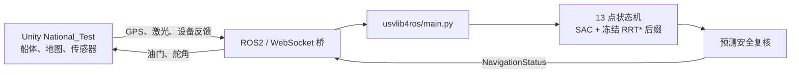

# 海航赛 2026 C4：National_Test 13 点智能船导航

本项目是“2026 海洋智能导航”C4 赛题的固定地图导航算法。它控制无人船从
`National_Test` 地图下方出生点驶入，依次到达 13 个比赛目标点，并通过 ROS2
桥接向 Unity 发布油门和舵角。

这份 README 面向第一次接触本项目的人。先按“5 分钟运行”完成一次现场复现，再阅读
架构、训练和故障排查部分。

赛事资料：[Maritime Intelligent Navigation 2026](https://spaitlab.github.io/Maritime-Intelligent-Navigation-2026/)

## 1. 项目解决什么问题

比赛环境由 Unity、ROS/MATLAB 环境和本仓库的 Python 控制器组成：



Python 进程只向 `NavigationStatus` 发布控制命令；`DeviceStatus` 只读，用于接收
Unity 的任务状态、船体反馈和时钟。代码不会向设备反馈话题自发布。

### 当前范围

- 只支持固定 `National_Test` 地图、已知静态障碍和下方出生点。
- 13 个比赛目标点按顺序推进；内部路线点不改变比赛计数。
- 第 1～11 个目标点由循环离散 SAC 控制。
- 船体确认到达第 11 点后，才切换到离线生成的 RRT* 冻结路线，跟踪
  第 11→12、12→13 段。
- 控制周期不运行 RRT*，因此不会因在线规划失败而持续输出零油门。
- 不支持随机地图、动态避碰、COLREGs 或旧 PPO/DQN 模型。

## 2. 当前交付快照

下列信息用于判断“代码、模型、地图”是否来自同一份交付：

| 项目 | 当前值 |
|---|---|
| 入口 | `usvlib4ros/main.py` |
| 入口 SHA-256 | `DCAB3C5F60D1357866015E77073F2AD403BF1E3AEE1A4FCA7BE319D39996B192` |
| 活动 checkpoint | `national_test_sac_v6_seed20260805_g1_t70_unity_validation_a346_v0.pt` |
| checkpoint SHA-256 | `7F28A95F80E583F260762D3E1DA9751C7232402D891FCCBD55AAA8CA07FFC352` |
| 模型阶段 | `UNITY_VALIDATION` |
| 离线训练回合 | 70 |
| Unity 适应回合 | 346 |
| 观测 | `local-waypoint-observation-v3`，166 维 |
| 动作 | `five-calibrated-controls-v3`，5 个离散动作 |
| RRT* 后缀终点容差 | 0.5 m |

活动状态保存在：

```text
artifacts/checkpoints/national_test_sac_active.json
artifacts/checkpoints/national_test_sac_v6_seed20260805_g1_t70_unity_validation_a346_v0.pt
artifacts/checkpoints/national_test_sac_v6_seed20260805_g1_t70_unity_validation_a346_v0.pt.json
artifacts/checkpoints/national_test_self_training_v6.pt
```

`national_test_sac_active.json` 同时记录 checkpoint 文件名、阶段和哈希。入口不会在该
文件缺失或哈希不一致时回退到旧模型。

> 当前模型处于确定性 Unity 验证阶段。这里记录的是可复现的活动状态，不把离线仿真
> 或合成回放表述为 Unity 现场 5/5 验收证据。

## 3. 目录结构

```text
.
├─ usvlib4ros/
│  ├─ main.py                         # 唯一比赛入口
│  ├─ navigation/
│  │  ├─ fixed_map_runtime.py         # 13 点状态转换与最终控制决策
│  │  ├─ fixed_map_service.py         # ROS 生命周期、自动复位、遥测
│  │  ├─ route_training_guide.py      # 冻结示范和 RRT* 后缀跟踪
│  │  └─ usv_ros2_controller.py       # ROS2 话题/服务桥
│  ├─ policy/
│  │  ├─ recurrent_sac.py             # GRU 离散 SAC
│  │  ├─ safety_supervisor.py         # 动作安全 mask 与最终复核
│  │  ├─ fixed_map_trainer.py         # 离线/Unity episode 学习
│  │  └─ self_training.py             # checkpoint、回放和阶段门控
│  ├─ mapping/data/
│  │  ├─ beihu_static_world_sidecar.json
│  │  ├─ national_test_fixed_route_corridor_v1.json
│  │  ├─ national_test_live_profile.json
│  │  └─ national_test_route_training_guide_v1.json
│  └─ planning/                       # 离线 RRT* 与船体动力学
├─ artifacts/checkpoints/             # 当前模型与可恢复训练状态
├─ artifacts/logs/                    # 运行时 JSONL 遥测（本地生成）
├─ tools/                              # 标定、训练、航路和报告脚本
├─ tests/                              # 定向 pytest
├─ reports/                            # CSV/SVG 训练证据
├─ config.json                        # 本地 ROS2 连接参数
├─ requirements.txt
└─ setup.py
```

## 4. 5 分钟运行：主办方交付目录

提交目录 `G:\NavAIg(3)` 已包含运行代码、地图资产、活动 checkpoint、manifest、
活动注册表和可恢复训练状态。不要把 `main.py` 单独复制到其他目录运行。

### 4.1 安装 Python 依赖

建议使用 64 位 Python 3.12。在 PowerShell 中执行：

```powershell
Set-Location 'G:\NavAIg(3)'
python -m pip install -r requirements.txt
```

依赖只有：

- `roslibpy==1.6.0`
- `numpy==2.2.6`
- `torch==2.12.1`

### 4.2 准备比赛环境

1. 启动主办方提供的 ROS/MATLAB 环境。
2. 打开 Unity，登录并加载 `National_Test`。
3. Unity 传感器中启用虚拟激光雷达和虚拟 GPS，建议均为 5 fps。
4. 确认 Unity 左上角 ROS2 IP 已连接。
5. 检查项目根目录的 `config.json`。交付环境不变时无需修改；环境变化时只更新
   `ros2.host`、`ros2.port` 和 `ros2.deviceId`。

连接参数只保存在本地 `config.json`，不要贴入报告、截图或公开日志。

### 4.3 启动算法

保持终端位于交付目录根目录：

```powershell
python usvlib4ros/main.py
```

正常启动时会看到类似：

```text
policy_mode=unity_test checkpoint=...\national_test_sac_v6_...\a346_v0.pt waiting for the train trigger...
```

这表示模型和地图资产已通过预检，进程正在等待 Unity。此时点击 Unity 的
“开始训练”。不要重复启动第二个 `main.py` 进程，否则两个控制器会竞争同一控制话题。

按 `Ctrl+C` 停止。服务退出前会发布零油门、零舵角。

## 5. 默认运行到底做了什么

裸命令 `python usvlib4ros/main.py` 的默认模式是 `unity_test`，并从活动注册表恢复
当前 `UNITY_VALIDATION` 状态：

1. 读取 GPS、72 路激光、设备反馈及数据新鲜度。
2. 校验任务是否激活、是否为自动模式、船体状态是否有限。
3. 推进已到达的比赛目标点，不在切点时停车或重置 GRU。
4. 构建 166 维 V3 观测。
5. 计算执行器可达动作和预测安全 mask。
6. 第 1～11 点由 SAC 选择动作。
7. 确认到达第 11 点后，跟踪冻结的 11→12、12→13 RRT* 后缀。
8. 最终安全复核后，只通过 `NavigationStatus` 发布百分比油门/舵角。
9. episode 完成、碰撞、异常或卡住后安全归零，并请求 Unity 自动复位和重新触发。
10. 逐周期遥测写入 `artifacts/logs/national-test-runtime-*.jsonl`。

如果只想冻结权重做一局确定性检查，可显式执行：

```powershell
python usvlib4ros/main.py `
  --policy-mode unity_test `
  --checkpoint "artifacts\checkpoints\national_test_sac_v6_seed20260805_g1_t70_unity_validation_a346_v0.pt" `
  --validate-only
```

显式给出 checkpoint 或 `--validate-only` 时不会做梯度更新。

## 6. 航点、碰撞兜底和 RRT* 后缀

### 航点语义

终端和遥测中的 `mission_index` 从 0 开始；Unity 界面的“第 N 点”从 1 开始。
`mission_index=10` 表示正在到达第 11 点。

- 第 11 点必须在 0.75 m 内确认到达，之后才能进入 RRT* 后缀。
- 第 12、13 点的成功容差为 0.5 m。
- 船体相邻两个采样位置的线段穿过终点 0.5 m 圆，也算到达，避免离散采样越过目标。

### 安全距离

当前地图附加净空和激光附加急停距离均为 `0.0 m`。这表示不再额外膨胀障碍物，
不表示允许穿过实体障碍；船体几何状态无效时仍会触发 `MAP_INVALID`。

为吸收 Unity 在狭窄处的偶发碰撞误报，存在以下受限兜底：

| 区域 | 最长持续时间 | 每局最多事件数 |
|---|---:|---:|
| 第 2→3 点 | 3 s | 1 |
| 第 4→5 点 | 3 s | 1 |
| 第 7→8 点 | 3 s | 1 |
| 第 9→10 点 | 3 s | 1 |
| 第 11 点及其后缀入口 | 6 s | 3 |

兜底只在已有上一条有效运动命令时短时保持该命令；超过时间或次数后仍按
`MAP_INVALID` 结束本局。

### 离线重建后两段航路

RRT* 只在离线工具中运行：

```powershell
python tools/rebuild_fixed_route_suffix.py
```

输出覆盖
`usvlib4ros/mapping/data/national_test_route_training_guide_v1.json` 中的
第 11→12、12→13 段，并重新计算 guide 哈希。当前两段终点误差均不超过 0.5 m；
运行时使用 0.75 m 前视和单调路线索引跟踪，不重新规划。

## 7. 从零复现训练（开发者）

当前交付件已经包含模型，主办方运行不需要执行本节。若要独立重建训练状态，请在
仓库副本中操作，避免覆盖提交用 checkpoint。

### 7.1 双向执行器标定

保持 Unity、ROS 和船体静止：

```powershell
python tools/calibrate_forward_control.py
```

脚本会生成：

```text
artifacts/logs/forward-control-v2-<timestamp>.json
```

### 7.2 离线 SAC 训练

```powershell
python tools/train_fixed_map_sac.py `
  --calibration-log "artifacts\logs\forward-control-v2-<timestamp>.json" `
  --seed 20260805
```

训练状态写入：

```text
artifacts/checkpoints/national_test_self_training_v6.pt
```

脚本按“离线训练块 → 确定性评估 → Unity 适应 → Unity 验证”的阶段机保存进度。
再次运行相同命令会恢复状态，而不是继承旧 schema 或偷偷回退到旧 checkpoint。

### 7.3 Unity 适应/验证

离线阶段写出活动注册表后，回到常规入口：

```powershell
python usvlib4ros/main.py
```

每局结束后，服务会请求 Unity 复位；复位成功后调用主办方任务服务重新触发下一局。
输入陈旧或操作者结束只安全停车，不把无效环境样本当作策略失败。

## 8. 日志、CSV 和 SVG

运行时日志记录：

- 策略提议动作；
- 安全 mask 与执行器可达 mask；
- 最终动作和百分比油门/舵角；
- 地图净空、航点索引、循环耗时；
- Unity episode 结果和训练 loss；
- 设备回读。

导出某次 Unity 运行：

```powershell
python tools/export_training_reports.py `
  --runtime-only `
  --runtime-log "artifacts\logs\national-test-runtime-<timestamp>.jsonl" `
  --output-dir "reports\national_test_v6_unity_<timestamp>"
```

导出离线训练：

```powershell
python tools/export_training_reports.py `
  --output-dir "reports\national_test_v6_offline_<timestamp>"
```

绘图在 episode 结束后离线执行，不进入 10 Hz 控制循环。

## 9. 最小验证

本项目不建议在现场运行全量回归。修改运行时、兜底或 RRT* 后缀后，只运行相关节点：

```powershell
python -m pytest -q `
  tests/test_direct_waypoint_control.py::test_frozen_route_guide_replays_unity_and_rrt_actions `
  tests/test_direct_waypoint_runtime.py::test_unity_adapt_hands_off_to_rrt_only_after_confirmed_point_eleven `
  tests/test_direct_waypoint_runtime.py::test_named_false_collision_zones_allow_one_map_invalid_incident `
  tests/test_direct_waypoint_runtime.py::test_point_eleven_map_invalid_grace_is_six_seconds_and_three_incidents `
  tests/test_direct_waypoint_runtime.py::test_thirteen_waypoints_advance_without_stop_or_gru_reset
```

这些测试验证状态转换和资产契约，不代替真实 Unity 航行。

## 10. 常见问题

### `active V6 checkpoint registry is missing`

交付不完整。确认 `artifacts/checkpoints/` 下的活动注册表、checkpoint、manifest 和
训练状态四类文件都在。若从 Git 克隆，先执行：

```powershell
git lfs pull
```

### `required National_Test assets are missing`

不要只复制 `main.py`。确认 `usvlib4ros/mapping/data/` 的四个 JSON 资产都在，并从
项目根目录启动。

### 终端停在 `waiting for the train trigger...`

这是正常等待，不是卡死。检查 Unity 已加载 `National_Test`、ROS IP 已连接，然后
点击“开始训练”。

### 连续显示 `POSE_STALE`、`SCAN_STALE` 或 `DEVICE_STALE`

检查 ROS/MATLAB/Unity 是否都在运行；确认 GPS 和激光雷达已启用；确认 `config.json`
对应当前 ROS2 地址和设备 ID。

### 显示 `DYNAMICS_INVALID` 且零输出

船体姿态、速度或角速度输入超出有效范围。算法按设计安全停车。先复位 Unity，再确认
传感器数据恢复，不能通过放宽 checkpoint 校验绕过。

### 第 11 点出口零输出

确认使用本 README 中的 `a346` checkpoint 和最新
`national_test_route_training_guide_v1.json`。旧后缀终点可能距目标约 2 m，不能与
当前 0.5 m 合同混用。

## 11. 开发约束

- `usvlib4ros/main.py` 是比赛入口，不修改。
- 不增加旧模型兼容层、migration 或 fallback。
- 不在控制周期调用在线规划器。
- `NavigationStatus` 是唯一控制输出。
- checkpoint、地图、走廊、动作协议和标定哈希不一致时直接失败。
- 修改只跑相关测试；真实 Unity 结果必须与离线证据分开表述。

## 12. Git 与交付说明

Git 提交包含源码、地图/路线资产、定向测试、报告证据、活动 checkpoint/manifest/
注册表，以及通过 Git LFS 保存的当前可恢复训练状态。克隆后应执行：

```powershell
git lfs install
git lfs pull
python -m pip install -r requirements.txt
```

主办方精简目录 `G:\NavAIg(3)` 不包含 `.git`、虚拟环境、pytest 缓存、历史
checkpoint、历史日志和实验中断文件，只保留直接运行和理解当前算法所需的内容。
